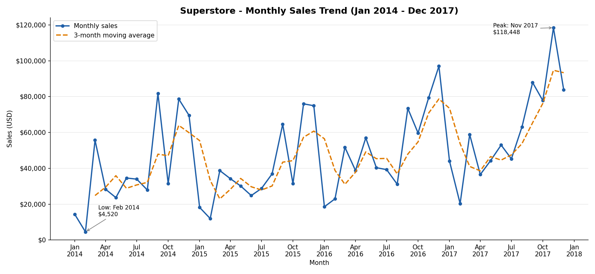

# Task 17 - Monthly Sales Trend (Superstore)

**Track:** Data Analytics  |  **Tools:** Excel, Python (pandas, matplotlib)

## Objective
Summarise sales by month and visualise the trend, to practise **date grouping** and **line charts**.

## Deliverables
| Deliverable | File |
|---|---|
| Monthly table (Excel, formula-driven) | `Task17_Monthly_Sales_Trend.xlsx` -> sheet **Monthly Sales** |
| Monthly table (CSV) | `monthly_sales_table.csv` |
| Line chart (Excel, native chart) | `Task17_Monthly_Sales_Trend.xlsx` -> sheet **Monthly Sales** |
| Line chart (Python image) | `monthly_sales_trend.png` |
| Python code | `01_add_order_dates.py`, `02_monthly_sales_trend.py` |



## Dataset
Superstore sales data: 9,994 order lines, Jan 2014 - Dec 2017, total sales **$2,297,200.86**.

> **Important data note.** The provided `SampleSuperstore.csv` has 13 columns and **no date column**, so a
> monthly trend cannot be built from it directly. I added `Order Date` from the full public Superstore
> file (same 9,994 rows) and matched it row by row. I did **not** use that file's other values, because
> that copy differs from the original in 199 rows. All Sales figures come from the original
> `SampleSuperstore.csv`.
>
> Checks done before trusting the dates:
> - 9 shared columns line up on every one of the 9,994 rows.
> - Yearly totals match the published Superstore totals (2014: $484,247.50, 2015: $470,532.51,
>   2016: $609,205.60, 2017: $733,215.26).
> - No Ship Date is earlier than its Order Date, and shipping gaps fit each ship mode
>   (Same Day 0-1 days, Standard Class 3-7 days).
>
> If your own copy already has an `Order Date` column, skip `01_add_order_dates.py`.

## Method
1. **Convert dates correctly** - `pd.to_datetime(..., format="%Y-%m-%d", errors="raise")`. An explicit format means no day/month guessing, and bad values raise an error instead of passing silently.
2. **Group by month** - `df.groupby(df["Order Date"].dt.to_period("M"))["Sales"].sum()`. Year and month are grouped together, so January 2014 is never mixed with January 2015.
3. **Sort chronologically** - `.sort_index()` on the period index (sorting month *names* would put "Apr" before "Jan").
4. **Check for gaps** - all 48 months are present.
5. **Add context columns** - month-on-month change (%) and a 3-month moving average.
6. **Reconcile** - the monthly table adds up to $2,297,200.86, equal to the total of the raw data.
7. **Visualise** - line chart with peak and low labelled.

In Excel, the same table is built with `SUMIFS` over the Data sheet (`>=` first of month, `<` first of next month), so it recalculates if the data changes.

## Key findings
| Year | Sales | Change vs previous year |
|---|---|---|
| 2014 | $484,247.50 | - |
| 2015 | $470,532.51 | -2.8% |
| 2016 | $609,205.60 | +29.5% |
| 2017 | $733,215.26 | +20.4% |

- **Upward trend overall.** After a small dip in 2015, sales grew strongly in 2016 and 2017.
- **Strong seasonality.** November (avg $88.1K), December ($81.3K) and September ($76.9K) are the highest months on average. September to December brings in about 50-54% of each year's sales.
- **Weak start of year.** February (avg $14.9K) and January ($23.7K) are the lowest months.
- **Peak month:** Nov 2017, $118,447.82. **Lowest month:** Feb 2014, $4,519.89.
- Month-to-month swings are large (single months moved by more than 100%), so the moving average is a better guide to direction than any single month.

## How to run
```bash
pip install pandas matplotlib
python 01_add_order_dates.py        # needs SampleSuperstore.csv in the same folder + internet
python 02_monthly_sales_trend.py    # creates the table and the chart
```

## Interview questions
**1. Best chart for time trends?**
A **line chart**. Points are joined in time order, so direction, seasonality, peaks and dips are easy to see, even across many periods. Bar charts suit a few periods or comparing categories, and pie charts are a poor fit for time.

**2. Why can date formatting cause errors?**
- Dates may load as **text**, so sorting and grouping break (text sorts "Apr" before "Jan").
- **Ambiguous formats**: 03/04/2016 is 3 April in India/UK but 4 March in the US, so sales can land in the wrong month without any error.
- **Mixed formats** in one column can create blanks or failed conversions.
- Grouping by **month name only** merges the same month from different years.
- Fix: convert with an explicit format, check for missing values, and group by year + month.

## Limitations
- Sales are order-line values as given in the dataset (not adjusted for returns or inflation).
- Only four years of data, so seasonality is based on four observations per month.
- The dates were sourced as described in the data note above.
