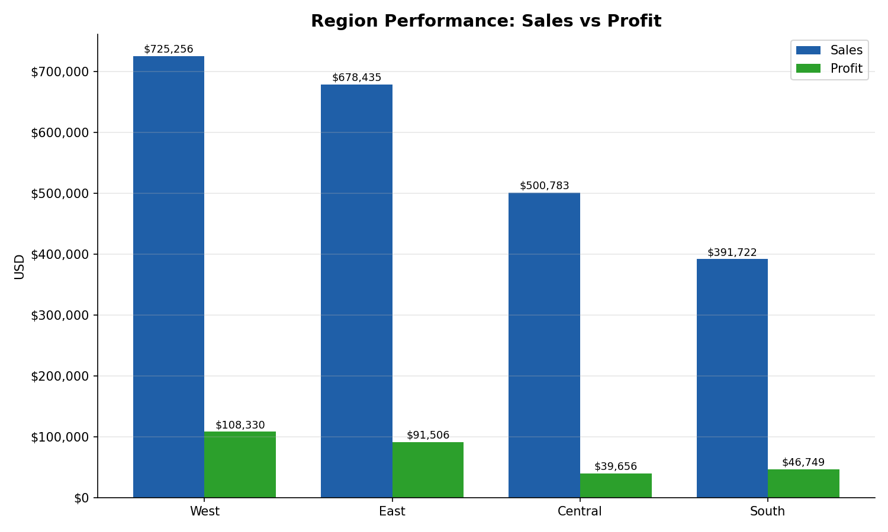
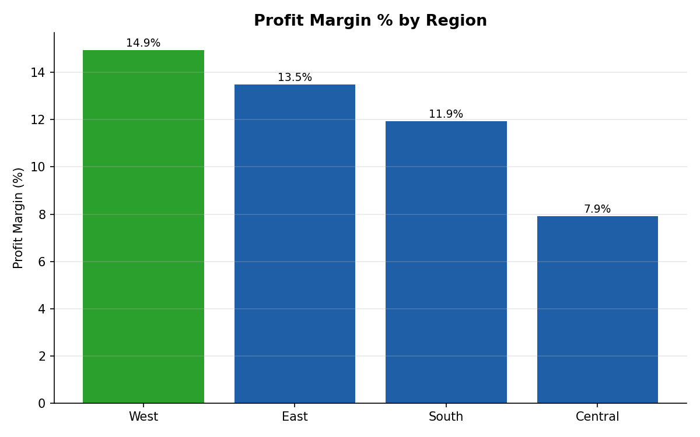

# Task 18 - Region Performance (Superstore)

**Track:** Data Analytics  |  **Tools:** Excel, Power BI

## Objective
Compare sales across regions, practising grouping and comparison.

## A note on the .pbix file
A `.pbix` is a binary Power BI project file that only **Power BI Desktop** can create — it can't be
generated from code. This package instead gives you a **cleaned, ready-to-import CSV** plus **exact
build steps** (below) so you can produce the `.pbix` yourself in about 5 minutes, with the same
numbers already verified in Excel/Python. The Excel workbook is a fully working, submittable
deliverable on its own if you need one immediately.

## Deliverables
| Deliverable | File |
|---|---|
| Region summary (Excel, formula-driven, with ranks) | `Task18_Region_Performance.xlsx` -> sheet **Region Summary** |
| Region summary (CSV) | `region_summary.csv` |
| Bar chart: Sales vs Profit (Excel native chart + image) | in the xlsx, and `region_sales_vs_profit.png` |
| Bar chart: Profit Margin % by region | `region_profit_margin.png` (also in the xlsx) |
| Cleaned dataset ready for Power BI | `SampleSuperstore_cleaned_for_PowerBI.csv` |
| Power BI build steps | this README, "Building the Power BI report" section |
| Python code | `01_region_performance.py` |




## Preprocessing done
1. Loaded `SampleSuperstore.csv` (9,994 rows).
2. Removed **17 exact duplicate rows** -> 9,977 rows used in the analysis.
3. Trimmed whitespace from `Region` text values.
4. Confirmed no missing values in Region, Sales, Profit, or Quantity.
5. Confirmed exactly 4 regions: Central, East, South, West.
6. Reconciled: region totals sum to $2,296,195.59, matching the cleaned dataset total exactly.

## Region Summary
| Region | Orders | Sales | Profit | Profit Margin % | Sales Rank | Profit Rank |
|---|---|---|---|---|---|---|
| West | 3,193 | $725,255.64 | $108,329.81 | 14.94% | 1 | 1 |
| East | 2,845 | $678,435.20 | $91,506.31 | 13.49% | 2 | 2 |
| Central | 2,319 | $500,782.85 | $39,655.88 | 7.92% | 3 | 4 |
| South | 1,620 | $391,721.90 | $46,749.43 | 11.93% | 4 | 3 |
| **Total** | **9,977** | **$2,296,195.59** | **$286,241.42** | **12.47%** | | |

**Ranking method:** ranked by Sales (descending) and separately by Profit (descending), using Excel's `RANK()` function. The two rankings are shown side by side because they disagree for Central and South (see findings).

## Key findings
- **West leads on both Sales and Profit** — it is the top region on both measures.
- **Central is 3rd in sales but 4th (last) in profit.** Central sells more than South but earns less profit, because its profit margin (7.92%) is the lowest of all four regions — likely driven by heavier discounting.
- **South ranks last in Sales but 3rd in Profit**, ahead of Central, because its margin (11.93%) is notably healthier.
- **East is a solid, consistent #2** on both Sales and Profit.
- Margin range: West 14.94% (best) down to Central 7.92% (worst) — almost double.

## Building the Power BI report
1. Open Power BI Desktop -> **Get Data** -> **Text/CSV** -> select `SampleSuperstore_cleaned_for_PowerBI.csv` -> Load.
2. In **Transform Data** (Power Query), confirm: `Sales`, `Profit`, `Discount` are Decimal Number; `Quantity`, `Postal Code` are Whole Number; everything else is Text. Remove duplicates on the whole table if not already removed (this file has them removed already).
3. Close & Apply.
4. Add a **Clustered Column Chart** -> Axis: `Region`; Values: `Sales` (Sum) and `Profit` (Sum). This is the required bar chart.
5. Add a **Table or Matrix** visual -> Rows: `Region`; Values: Sum of Sales, Sum of Profit, Sum of Quantity. This is the region summary.
6. Add two measures in the Data pane for the ranking/margin hints:
   ```
   Profit Margin % = DIVIDE(SUM(SampleSuperstore_cleaned_for_PowerBI[Profit]), SUM(SampleSuperstore_cleaned_for_PowerBI[Sales]))
   Sales Rank = RANKX(ALL(SampleSuperstore_cleaned_for_PowerBI[Region]), CALCULATE(SUM(SampleSuperstore_cleaned_for_PowerBI[Sales])))
   Profit Rank = RANKX(ALL(SampleSuperstore_cleaned_for_PowerBI[Region]), CALCULATE(SUM(SampleSuperstore_cleaned_for_PowerBI[Profit])))
   ```
7. Add `Profit Margin %`, `Sales Rank`, `Profit Rank` as extra columns in the table visual, and format `Profit Margin %` as a percentage.
8. Save as `Task18_Region_Performance.pbix`.

## How to run the Python script
```bash
pip install pandas matplotlib
python 01_region_performance.py
```

## Interview questions
**1. Why compare profit with sales?**
Sales alone measures revenue, not how much of it a region actually keeps. A region can have high sales but low profit if it discounts heavily or sells low-margin products — that's exactly what happens here: Central has higher sales than South but lower profit, because its margin is much thinner. Comparing both prevents rewarding "big but unprofitable" regions over "smaller but efficient" ones.

**2. How would you rank regions?**
Rank on more than one measure and look at where they disagree:
- **Sales rank** — total revenue generated, ranked descending.
- **Profit rank** — total profit earned, ranked descending.
- **Profit margin %** — profit ÷ sales, which normalises for size and shows efficiency.
A region that's top on all three (like West here) is the strongest performer. A mismatch between sales rank and profit rank (like Central and South) flags a region worth investigating — usually pricing, discounting, or product mix.

## Limitations
- Profit and Sales figures are order-line totals as provided; no adjustment for returns, taxes, or shipping cost.
- Only 4 regions, all within the United States — no regional cost-of-living or market-size context is included.
