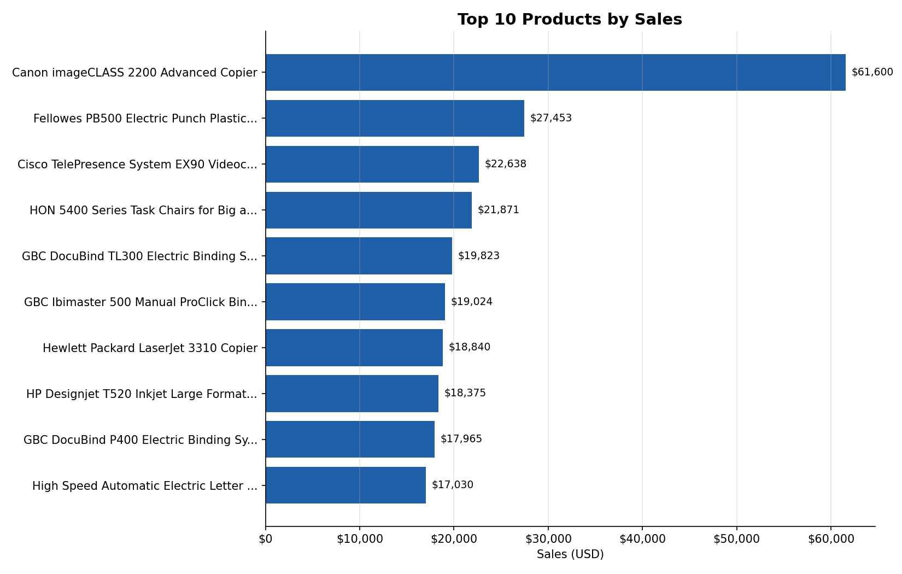

# Task 19 - Top 10 Products by Sales (Superstore)

**Track:** Data Analytics  |  **Tools:** Excel, Python (pandas, matplotlib)

## Objective
Identify the top 10 products by sales, practising ranking, sorting, and tie handling.

## Deliverables
| Deliverable | File |
|---|---|
| Top-10 table (Excel, formula-driven) | `Task19_Top10_Products.xlsx` -> sheet **Top 10 Products** |
| Top-10 table (CSV) | `top10_products.csv` |
| Full ranked product list (1,850 products) | `Task19_Top10_Products.xlsx` -> sheet **All Products** |
| Chart (Excel native + image) | in the xlsx, and `top10_products_chart.png` |
| Python code | `01_add_product_names.py`, `02_top10_products.py` |



## Data note - important
`SampleSuperstore.csv` has **no product-level column**, only `Sub-Category` (17 groups), so "Top 10
Products" cannot be built from it directly. I added `Product Name` and `Product ID` from a public
reference copy of the Superstore dataset, matched **row by row**, the same validated approach used in
Task 17 for `Order Date`:

- 9 shared columns (Ship Mode, Segment, Country, City, State, Postal Code, Region, Sub-Category,
  Discount) line up on every one of the 9,994 rows before the match is trusted.
- Every **Sales, Profit and Quantity** value used in this analysis is from the original
  `SampleSuperstore.csv` — only the product name/ID label was borrowed.

If your own copy of the dataset already has a `Product Name` column, skip `01_add_product_names.py`
and run the analysis script directly on it.

## Preprocessing done
1. Merged in Product Name/ID (see note above), validated.
2. Removed 4 exact duplicate rows -> 9,990 rows used.
3. Trimmed whitespace from `Product Name`.
4. **Aggregated to product level** - the same product appears on multiple order lines, so Sales,
   Profit and Quantity are summed per product before ranking (ranking raw order lines would let one
   product show up multiple times and crowd out others).

## How ties were checked and handled
- Ranked with `rank(method="min")` in Python / `RANK()` in Excel: **tied values get the same rank**, and
  the next rank number is skipped (e.g. two products tied for 5th both show rank 5, and the next
  distinct value gets rank 7, not 6). This avoids arbitrarily breaking a real tie.
- Checked the whole product list for ties: **48 products** share their exact Sales total with at least
  one other product somewhere in the 1,850-product list.
- Specifically checked the **rank-10 boundary**: in this dataset, no other product ties the 10th-place
  product's sales value, so the Top 10 is exactly 10 distinct products. The `Tied?` column and the
  boundary-tie count in the Excel sheet make this auditable rather than assumed.

## Top 10 Products by Sales
| Rank | Product | Category | Sales | Profit |
|---|---|---|---|---|
| 1 | Canon imageCLASS 2200 Advanced Copier | Technology | $61,599.82 | $25,199.93 |
| 2 | Fellowes PB500 Electric Punch Plastic Comb Binding Machine | Office Supplies | $27,453.38 | $7,753.04 |
| 3 | Cisco TelePresence System EX90 Videoconferencing Unit | Technology | $22,638.48 | -$1,811.08 |
| 4 | HON 5400 Series Task Chairs for Big and Tall | Furniture | $21,870.58 | $0.00 |
| 5 | GBC DocuBind TL300 Electric Binding System | Office Supplies | $19,823.48 | $2,233.51 |
| 6 | GBC Ibimaster 500 Manual ProClick Binding System | Office Supplies | $19,024.50 | $760.98 |
| 7 | Hewlett Packard LaserJet 3310 Copier | Technology | $18,839.69 | $6,983.88 |
| 8 | HP Designjet T520 Inkjet Large Format Printer - 24" | Technology | $18,374.90 | $4,094.98 |
| 9 | GBC DocuBind P400 Electric Binding System | Office Supplies | $17,965.07 | -$1,878.17 |
| 10 | High Speed Automatic Electric Letter Opener | Office Supplies | $17,030.31 | -$262.00 |

**Total: $244,620.20 — 10.7% of all sales** comes from just 10 of the 1,850 products sold.

## Key findings
- The **#1 product alone** (Canon copier, $61.6K) sells more than double #2, and makes up about
  25% of the Top 10's total — a single standout item, not a gradual drop-off.
- **Office Supplies dominates the list** (5 of 10 products, mostly binding machines), followed by
  Technology (4) and Furniture (1) — high unit price drives these rankings more than order volume.
- **Profit doesn't track sales.** Three of the Top 10 (Cisco unit, GBC DocuBind P400, Letter Opener)
  are **loss-making** despite being top sellers by revenue — worth flagging separately from a
  "top by profit" list.
- No product's sales exactly ties another at the rank-10 cutoff, so this Top 10 is unambiguous.

## How to run
```bash
pip install pandas matplotlib
python 01_add_product_names.py   # only needed if Product Name isn't already in your file
python 02_top10_products.py
```

## Interview questions
**1. How do you handle ties?**
Use a ranking method that treats equal values consistently instead of arbitrarily picking one first:
- **`min` (standard competition ranking)** — tied items share the same rank, and the next rank is
  skipped (5, 5, 7). This is what I used.
- **`dense`** — tied items share the same rank, but the next rank does **not** skip (5, 5, 6).
- Either way, the choice should be stated explicitly, and if a tie sits right at the cutoff (e.g. two
  products tied for 10th place), you either include both (documenting that the "Top 10" is really 11
  rows) or use a tiebreaker (e.g. higher profit, more units sold) — never drop one silently.

**2. Why use Top-10 analysis?**
- It highlights where concentration is: here, 10 of 1,850 products (0.5%) generate over 10% of sales,
  which is useful for stocking, promotion and negotiation priorities.
- It's simple to communicate to non-technical stakeholders compared to a full ranked list.
- It surfaces standout items (like the #1 copier) that a category-level view would hide.
- It's a natural entry point to deeper questions — e.g. checking whether top sellers are also
  profitable, which this analysis shows is not always true.

## Limitations
- Sales/Profit are order-line totals as provided, not adjusted for returns.
- Rankings reflect this 4-year sample only, not current inventory or demand.
- Product Name was sourced as described in the data note; validate against your own source of truth
  if one exists.
