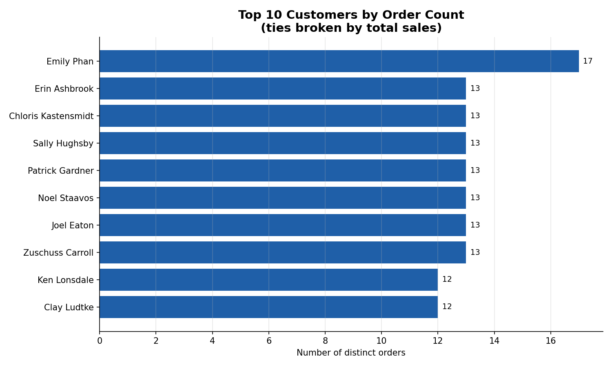
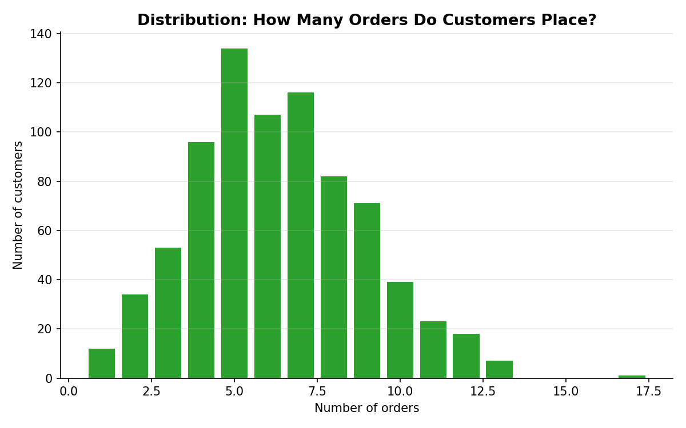

# Task 20 - Customer Order Count (Superstore)

**Track:** Data Analytics  |  **Tools:** Excel, SQL

## Objective
Count orders per customer and identify frequent buyers, to understand simple customer behaviour.

## Deliverables
| Deliverable | File |
|---|---|
| Customer order table (Excel, formula-driven) | `Task20_Customer_Order_Count.xlsx` -> sheet **All Customers** |
| Customer order table (CSV) | `customer_order_table.csv` |
| Top customers (frequent buyers, Excel + chart) | `Task20_Customer_Order_Count.xlsx` -> sheet **Top Frequent Customers** |
| Top customers (CSV) | `top10_frequent_customers.csv` |
| Charts | `top10_customers_chart.png`, `order_count_distribution.png` |
| SQL queries | `03_customer_order_count.sql` |
| Python code | `01_add_customer_order_ids.py`, `02_customer_order_count.py` |




## Data note - important
`SampleSuperstore.csv` has **no Order ID or Customer ID column at all** — nothing to group orders or
customers by. I added `Order ID`, `Order Date`, `Customer ID` and `Customer Name` from the same
validated public reference file used in Tasks 17 and 19, matched **row by row**:
- 9 shared columns line up on every one of the 9,994 rows before the match is trusted.
- All Sales/Profit/Quantity values used in the analysis remain from the original file.

If your own copy already has `Order ID` and `Customer ID`, skip `01_add_customer_order_ids.py`.

## Preprocessing done
1. Merged in Order ID / Customer ID (see note above), validated.
2. Removed 1 exact duplicate row -> 9,993 order lines used.
3. **Avoided duplicate order lines (the hint's key point):** one `Order ID` can span several rows —
   a customer buying 3 products in one visit creates 3 rows with the *same* Order ID. Counting rows
   would overstate how often someone orders. Order lines per order here range from 1 to 14
   (average 2.00). **Order Count = number of DISTINCT Order IDs per customer**, not row count.
4. Result: 9,993 order lines collapse to **5,009 distinct orders** across **793 distinct customers**.
5. Reconciled: sum of per-customer sales = $2,296,919.49, matching the cleaned dataset total exactly.

## Customer vs Order count - what the table shows
| Metric | Meaning |
|---|---|
| Order Count | Distinct orders a customer placed (the real behavioural metric) |
| Order Lines | Rows / products bought across all orders (always ≥ Order Count) |
| Total Sales | Sum of Sales across all of a customer's order lines |
| Avg Order Value | Total Sales ÷ Order Count |

## Top frequent buyers
| Rank | Customer | Order Count | Total Sales |
|---|---|---|---|
| 1 | Emily Phan | 17 | $5,478.06 |
| 2 (tie) | Zuschuss Carroll | 13 | $8,025.71 |
| 2 (tie) | Joel Eaton | 13 | $6,760.82 |
| 2 (tie) | Sally Hughsby | 13 | $3,406.84 |
| 2 (tie) | Chloris Kastensmidt | 13 | $3,154.86 |
| 2 (tie) | Patrick Gardner | 13 | $3,086.91 |
| 2 (tie) | Noel Staavos | 13 | $2,964.82 |
| 2 (tie) | Erin Ashbrook | 13 | $2,846.71 |
| 9 (tie, 18-way) | Ken Lonsdale, Clay Ludtke, and 16 others | 12 | varies |

**Ties matter here.** Ranked with `RANK()`, and there's a real 18-way tie at 12 orders sitting right at
the rank-9/10 boundary — a plain "take the first 10 rows" would arbitrarily cut off 8 equally frequent
customers. The `Top Frequent Customers` sheet shows the strict top 10 (ties broken by Total Sales,
clearly stated), while `All Customers` preserves the honest full list so nothing is hidden.

## Key findings
- Order frequency is roughly bell-shaped: most customers place **5-9 orders**; very few place 1 or
  fewer than 3, and only 1 customer (Emily Phan) reaches as high as 17.
- The most frequent buyer isn't necessarily the highest spender: Emily Phan has the most orders (17)
  but only $5,478 in sales, while several 12-13 order customers spend far more per order (e.g. Ken
  Lonsdale: 12 orders, $14,175).
- **Frequency and spend are different signals** — a retention program targeting "frequent buyers" and
  one targeting "high spenders" would select different, only partly-overlapping customers.

## How to run
```bash
pip install pandas matplotlib
python 01_add_customer_order_ids.py   # only needed if Order ID/Customer ID aren't already in your file
python 02_customer_order_count.py
```
For SQL, load the merged CSV into a table (e.g. `superstore`) and run `03_customer_order_count.sql`
in any SQL engine (tested logic against SQLite; standard ANSI SQL, works in MySQL/Postgres/SQL Server
with minor syntax tweaks for the `SELECT ... INTO`).

## Interview questions
**1. Customer vs order count?**
- **Customer count** = how many *distinct people* bought something (793 here).
- **Order count** = how many *distinct transactions* happened (5,009 here) — one customer can place
  many orders, so order count is always ≥ customer count.
- They answer different questions: customer count measures reach/acquisition; order count (per
  customer) measures frequency/loyalty. Confusing "number of order lines" with "number of orders" is
  the most common mistake — one order can contain many product lines, so raw row counts overstate
  both order count and, indirectly, customer activity.

**2. Why is customer ID important?**
- **Names aren't unique or reliable** for grouping — two different customers can share a name, and
  the same customer's name can be entered inconsistently (typos, casing, "J. Smith" vs "John Smith").
  Customer ID is a stable key that avoids merging different people or splitting one person into two.
- It's what makes joins and aggregation correct across tables (orders, returns, support tickets), and
  it's the basis for tracking a customer's history and lifetime value over time.

## Limitations
- Order ID / Customer ID were sourced as described in the data note; validate against your source of
  truth if one exists.
- "Frequent buyer" here is based on raw order count only, with no time window (e.g. orders in the
  last 12 months) — a customer active 4 years ago counts the same as one active last month.
