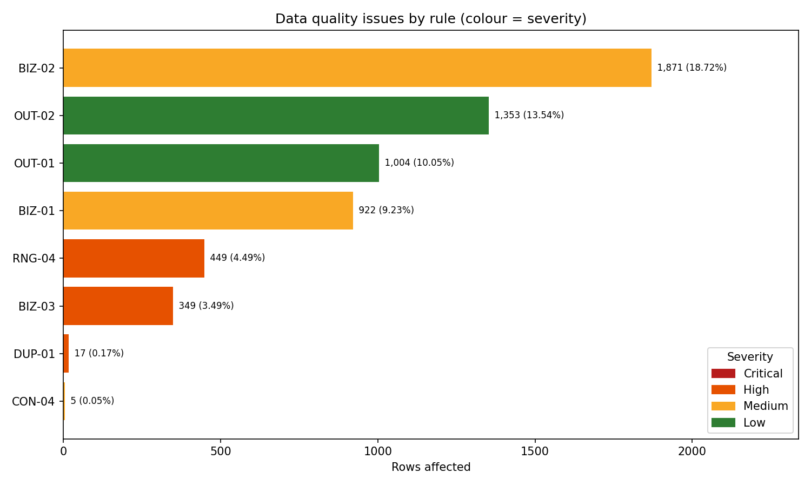

# Data Quality Audit Report - Superstore Sales Dataset

**Task 24 | Data Analytics Track | Prepared by:** Radhika  |  **Date:** 01 October 2026
**Source file:** `SampleSuperstore.csv`  |  **Tool:** Python 3 + Pandas

---

## 1. Executive summary

The Superstore dataset is structurally healthy: it has **no nulls and no invalid categorical labels**, and
every Sub-Category, State and Postal Code resolves to a single Category / Region / State.
The audit still surfaced **8 of 25 rules with violations**. The issues that matter most:

1. **Postal Code stored as a number** - 449 rows (4.49%) lost their leading zero
   (CT, MA, ME, NH, NJ, RI, VT). Any ZIP join/lookup on these rows would silently fail. *Fixed.*
2. **17 exact duplicate rows** (0.17%). There is no Order ID in this file, so
   a duplicate cannot be proven, but identical values across all 13 columns (incl. a 4-decimal Sales figure)
   are very unlikely to be coincidence. *Removed, documented.*
3. **Profitability red flags** - 1,871 loss-making lines (18.72%),
   349 lines where the loss exceeds the sale value, and a clear discount-to-loss pattern.
   These are *business findings, not errors*, so they are flagged, not deleted.
4. **One ZIP -> City conflict** (92024 appears as both San Diego and Encinitas). Left unchanged because
   the majority value (San Diego) is the *wrong* one - needs a USPS reference to fix.

**Dataset size:** 9,994 rows x 13 columns -> **9,977 rows** after cleaning.

## 2. Quality scorecard

| Dimension | Before | After cleaning |
|---|---|---|
| Completeness | 100.0% | 100.0% |
| Uniqueness | 99.83% | 100.0% |
| Validity | 95.51% | 100.0% |
| Consistency | 99.95% | 99.95% |
| **Overall (mean)** | **98.82%** | **99.99%** |

Scores = % of rows that pass every rule in that dimension (Completeness = % of non-null cells).
Plausibility rules are reported separately because they are *flags for business review*, not defects.

## 3. Full rule results (the repeatable checklist)

| rule_id | dimension | rule | severity | rows_affected | pct_affected | status |
|---|---|---|---|---|---|---|
| RNG-04 | Validity | US ZIP code must have 5 digits (leading zero lost when stored as integer) | High | 449 | 4.49 | FAIL |
| BIZ-03 | Plausibility | Loss larger than the sale value (Profit / Sales < -100%) | High | 349 | 3.49 | FAIL |
| BIZ-02 | Plausibility | Loss-making line (Profit < 0) | Medium | 1871 | 18.72 | FAIL |
| BIZ-01 | Plausibility | Deep discount (>= 50%) - needs business review | Medium | 922 | 9.23 | FAIL |
| DUP-01 | Uniqueness | Exact duplicate rows (all 13 columns identical; extra copies only) | High | 17 | 0.17 | FAIL |
| OUT-02 | Plausibility | Profit outlier (Tukey 1.5xIQR fence within each Sub-Category) | Low | 1353 | 13.54 | FAIL |
| OUT-01 | Plausibility | Sales outlier (Tukey 1.5xIQR fence within each Sub-Category) | Low | 1004 | 10.05 | FAIL |
| CON-04 | Consistency | Each Postal Code must map to one City | Medium | 5 | 0.05 | FAIL |
| MISS-01 | Completeness | Rows containing any null / NaN value | Critical | 0 | 0.0 | PASS |
| DOM-01 | Validity | Ship Mode must be in the allowed list | Medium | 0 | 0.0 | PASS |
| RNG-05 | Validity | Profit cannot exceed Sales (margin > 100%) | High | 0 | 0.0 | PASS |
| RNG-03 | Validity | Discount must lie in [0, 1] | Critical | 0 | 0.0 | PASS |
| RNG-02 | Validity | Quantity must be an integer between 1 and 100 | High | 0 | 0.0 | PASS |
| MISS-02 | Completeness | Blank or whitespace-only strings in text fields | High | 0 | 0.0 | PASS |
| RNG-01 | Validity | Sales must be > 0 | Critical | 0 | 0.0 | PASS |
| DOM-02 | Validity | Segment must be in the allowed list | Medium | 0 | 0.0 | PASS |
| DOM-03 | Validity | Region must be in the allowed list | Medium | 0 | 0.0 | PASS |
| CON-03 | Consistency | Each Postal Code must belong to exactly one State | High | 0 | 0.0 | PASS |
| CON-02 | Consistency | Each State must map to exactly one Region | High | 0 | 0.0 | PASS |
| CON-01 | Consistency | Each Sub-Category must map to exactly one Category | High | 0 | 0.0 | PASS |
| DOM-06 | Validity | State must be a valid US state name / DC | High | 0 | 0.0 | PASS |
| DOM-05 | Validity | Country must be 'United States' | Medium | 0 | 0.0 | PASS |
| DOM-04 | Validity | Category must be in the allowed list | Medium | 0 | 0.0 | PASS |
| CON-05 | Consistency | Leading/trailing/double spaces or ALL-lower / ALL-UPPER casing in text fields | Low | 0 | 0.0 | PASS |
| BIZ-04 | Plausibility | Loss-making line despite 0% discount (unexplained loss) | High | 0 | 0.0 | PASS |

Rules that passed (17): MISS-01, DOM-01, RNG-05, RNG-03, RNG-02, MISS-02, RNG-01, DOM-02, DOM-03, CON-03, CON-02, CON-01, DOM-06, DOM-05, DOM-04, CON-05, BIZ-04.

## 4. Findings in detail

### 4.1 Completeness
No null values and no blank strings in any of the 13 columns (MISS-01, MISS-02 pass).
The rules stay in the checklist so that the next data refresh is protected.

### 4.2 Uniqueness
**DUP-01:** 17 extra copies of rows that are identical on every column
(34 rows involved in total). Removing them changes total Sales by
**$1,005.27** and Profit by **$155.60**.
*Caveat:* with no Order ID / Order Date the same customer could legitimately buy the same item twice on the
same day; recommend the data owner confirm. This is the one assumption in the cleaning step.

### 4.3 Validity / range
* **RNG-04 Postal Code:** 449 values have only 4 digits (e.g. `6370` should be `06370`) -
  all in New England / NJ states. Cause: the column was read as an integer. Fix: store as 5-character text.
* Sales > 0, Quantity 1-14, Discount 0-0.8, Profit <= Sales: **all pass**.
* All categorical domain checks (Ship Mode, Segment, Region, Category, Country, State) pass.
* Coverage note: 49 of 51 US jurisdictions are present - **Alaska and Hawaii never appear**.
  Not an error, but any "national" claim should say "contiguous US + DC".

### 4.4 Consistency
* Sub-Category -> Category, State -> Region and Postal Code -> State are perfectly consistent.
* **CON-04:** Postal Code 92024 maps to San Diego (34 rows) and Encinitas (5 rows).
  92024 is an Encinitas ZIP, so the *minority* value is correct. This is a good example of why
  consistency fixes must not blindly use the majority value.
* Note: 57 city names (e.g. Springfield, Columbia) exist in several states. That is **normal**,
  not an error - City alone is not a key; use City + State.

### 4.5 Plausibility / business flags
| Flag | Rows | % | Comment |
|---|---|---|---|
| Loss-making (Profit < 0) | 1,871 | 18.72% | |
| Deep discount (>= 50%) | 922 | 9.23% | Every deep-discount line is loss-making (100% overlap with Profit < 0) |
| Loss > sale value | 349 | 3.49% | Cost exceeds revenue by >2x - pricing/cost check |
| Loss at 0% discount | 0 | 0% | Passes - no unexplained losses |
| Sales outlier (IQR per sub-category) | 1,004 | 10.05% | Kept - mostly Binders, Paper, Furnishings: plausible bulk orders, not errors |
| Profit outlier (IQR per sub-category) | 1,353 | 13.54% | Kept |

**Discount vs margin (average Profit / Sales):**

| 0% | 10% | 15% | 20% | 30% | 32% | 40% | 45% | 50% | 60% | 70% | 80% |
|---|---|---|---|---|---|---|---|---|---|---|---|
| 34.0% | 15.6% | 3.4% | 17.7% | -11.5% | -17.4% | -22.2% | -45.5% | -54.9% | -68.9% | -79.5% | -182.5% |

Margin turns negative from a 30% discount onwards - the single most useful business insight in the file.

## 5. Prioritisation (what to fix first)

Priority score = severity weight (Critical 4 / High 3 / Medium 2 / Low 1) x (1 + log10(1 + rows affected)).

| priority_rank | rule_id | severity | rows_affected | priority_score | fix |
|---|---|---|---|---|---|
| 1 | RNG-04 | High | 449 | 10.96 | Store as text and left-pad with zeros to 5 chars |
| 2 | BIZ-03 | High | 349 | 10.63 | Keep; flag_extreme_loss = 1 |
| 3 | BIZ-02 | Medium | 1871 | 8.54 | Keep; flag_loss = 1 |
| 4 | BIZ-01 | Medium | 922 | 7.93 | Keep; flag_deep_discount = 1 |
| 5 | DUP-01 | High | 17 | 6.77 | Keep first occurrence, drop repeats |
| 6 | OUT-02 | Low | 1353 | 4.13 | Keep; flag_profit_outlier = 1 |
| 7 | OUT-01 | Low | 1004 | 4.0 | Keep; flag_sales_outlier = 1 |
| 8 | CON-04 | Medium | 5 | 3.56 | Verify against USPS reference (do NOT auto-fix by majority vote) |

Rule of thumb applied: **(1) anything that breaks a join or a total -> (2) anything that distorts a KPI ->
(3) anything that needs a business decision -> (4) cosmetic.**

## 6. Cleaning actions applied

1. Stripped/collapsed whitespace in text columns; title-cased only ALL-lower/UPPER values
2. Postal Code converted to 5-digit text (449 zero-padded)
3. Null / blank handling executed (rows dropped: 0)
4. Removed 17 exact duplicate rows
5. Added derived columns (Profit Margin, Unit List Price) and 5 review flags

### Before vs after (rules that had violations)

| rule_id | severity | rows_affected | action | rows_after_cleaning |
|---|---|---|---|---|
| RNG-04 | High | 449 | FIX | 0 |
| BIZ-03 | High | 349 | FLAG | 348 |
| BIZ-02 | Medium | 1871 | FLAG | 1869 |
| BIZ-01 | Medium | 922 | FLAG | 921 |
| DUP-01 | High | 17 | REMOVE | 0 |
| OUT-02 | Low | 1353 | FLAG | 1353 |
| OUT-01 | Low | 1004 | FLAG | 1003 |
| CON-04 | Medium | 5 | FLAG | 5 |

Rows with action **FLAG** keep their count after cleaning on purpose - they are retained and marked with a
`flag_*` column so analysts can include or exclude them.

## 7. Recommendations

1. Export Postal Code as **text** at source (or store it as `CHAR(5)`).
2. Add **Order ID, Order Date and Customer ID** to the extract so duplicates can be proven and time-based checks added.
3. Add a **USPS ZIP reference table** and fix CON-04 (92024) from it.
4. Put the rule registry in the data pipeline so it runs automatically on every refresh and fails loudly on Critical rules.
5. Ask the pricing team to review the 922 lines discounted >= 50% and the 349 extreme-loss lines.

## 8. Limitations

* No Order ID / dates / product name -> row-level duplicates and time-series checks are limited.
* Reference checks use internal majority mapping (and a hard-coded state list), not an external gold source.
* Outlier thresholds (1.5 x IQR, 50% discount) are conventions and should be tuned with the business.
