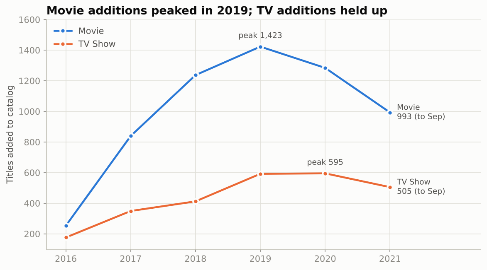
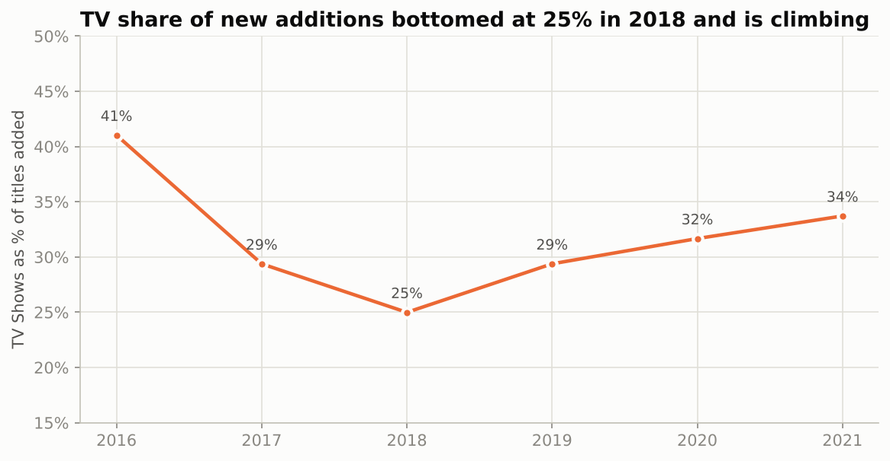
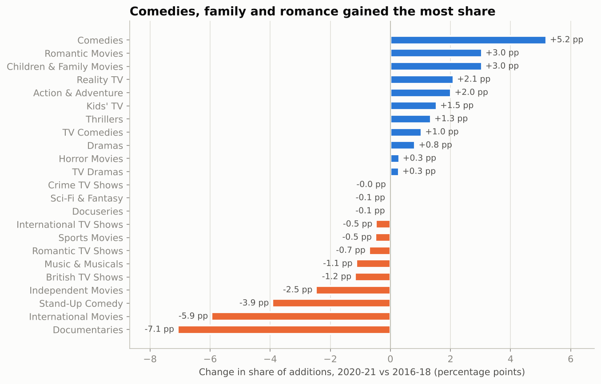
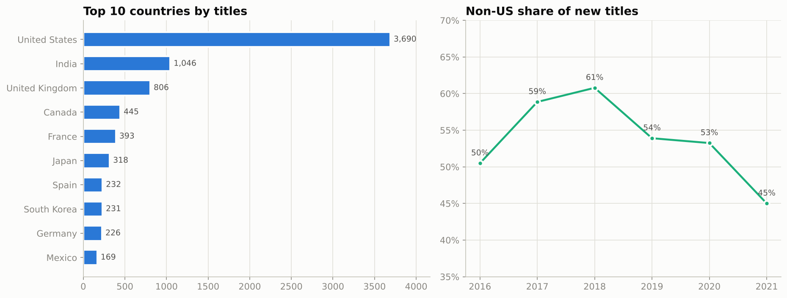

# OTT Streaming Content Trend Analysis (Netflix)

Exploratory data analysis of the Netflix titles catalog, framed the way a content strategy or growth team would run it: what has changed in the catalog, why it might matter, and **what to greenlight next**.

> **Business question:** How has the catalog changed over the years by format, genre, audience rating and region, and what should the content acquisition team do about it?

## Key findings

| # | Insight | Evidence |
|---|---|---|
| 1 | **Growth has shifted from movies to series** | Movie additions peaked in 2019 (1,423) and fell to 993 by Sep 2021. TV share of new titles rose from 25% (2018) to 34% (2021). 67% of shows have just one season. |
| 2 | **Comedy, family and romance are gaining share** | Comedies +5.2 pp, Romantic Movies +3.0 pp, Children & Family +3.0 pp (2020-21 vs 2016-18). Kids' share of new titles: 7.8% (2019) to 12.8% (2021). |
| 3 | **International growth has cooled** | Non-US share of new titles fell from 61% (2018) to 45% (2021). India's additions dropped 43% from the 2018 peak to 2020. Fresh content (added within 1 year of release) fell from 66% to 51%. |

Full recommendations: [`reports/content_strategy_memo.md`](reports/content_strategy_memo.md)

## Visual highlights

| | |
|---|---|
|  |  |
|  |  |

All 10 charts are in [`images/`](images/) and embedded in the notebook.

## Project structure

```
netflix-content-strategy/
├── data/
│   ├── netflix_titles.csv        # raw dataset (Kaggle)
│   ├── netflix_clean.csv         # cleaned, one row per title
│   ├── netflix_genres.csv        # exploded: title x genre
│   ├── netflix_countries.csv     # exploded: title x country
│   └── netflix.db                # SQLite copy used by the SQL queries
├── notebooks/
│   └── netflix_eda.ipynb         # full EDA notebook (executed, 10 charts)
├── sql/
│   └── queries.sql               # 14 core aggregation queries
├── scripts/
│   └── clean_data.py             # reproducible cleaning pipeline
├── reports/
│   ├── content_strategy_memo.md  # 3 actionable insights for acquisition team
│   └── netflix_eda.html          # HTML export of the notebook
├── images/                       # chart PNGs
├── requirements.txt
└── README.md
```

## Dataset

Netflix titles catalog: **8,807 rows x 12 columns** (`show_id, type, title, director, cast, country, date_added, release_year, rating, duration, listed_in, description`). Titles added Jan 2008 to 25 Sep 2021, so **2021 is a partial year**.

## Data cleaning

| Issue | Fix |
|---|---|
| Nulls in `director` (2,634), `cast` (825), `country` (831) | Filled with `"Unknown"`; excluded from country analysis |
| 3 rows with runtime stored in `rating` | Moved to `duration`, rating set to `"Not Rated"` |
| `date_added` stored as text | Parsed to datetime; `year_added`, `month_added` created |
| `duration` mixes minutes and seasons | Split into numeric `duration_min` (movies) and `seasons` (TV) |
| Multi-valued `listed_in` and `country` | Exploded into long tables for genre and country analysis |
| 1 duplicate title | Dropped (8,807 to 8,806 rows) |
| 14 rating codes | Grouped into audience segments: Kids / Teens / Adults / Not Rated |
| Derived features | `primary_country`, `primary_genre`, `lag_years` (release to platform arrival) |

## Analysis covered

1. Catalog growth: titles added per year by type
2. Format mix: TV share of additions
3. Top genres for Movies and TV
4. Genre share heatmap by year added
5. Audience (rating) mix over time
6. Regional mix: top countries and non-US share
7. Country momentum (US, India, UK)
8. Duration: movie runtime trend and TV season distribution
9. Content freshness (release year vs year added)
10. Genre momentum: share change 2016-18 vs 2020-21

## SQL

[`sql/queries.sql`](sql/queries.sql) holds 14 named queries (SQLite): conditional aggregation, CTEs, window functions (`ROW_NUMBER`, `SUM() OVER`), and joins across `titles`, `title_genres` and `title_countries`. The notebook runs them against `data/netflix.db` and asserts that two of them match the pandas results.

```sql
-- Which genres are gaining share of new additions? (excerpt)
SELECT g.genre,
       ROUND(100.0 * SUM(b.period = 'late')  / (SELECT t FROM totals WHERE period = 'late'),  2) AS late_share_pct,
       ROUND(100.0 * SUM(b.period = 'early') / (SELECT t FROM totals WHERE period = 'early'), 2) AS early_share_pct
FROM title_genres g JOIN base b ON b.show_id = g.show_id
GROUP BY g.genre;
```

## How to run

```bash
git clone <your-repo-url>
cd netflix-content-strategy
pip install -r requirements.txt

python scripts/clean_data.py          # rebuilds cleaned CSVs and netflix.db
jupyter notebook notebooks/netflix_eda.ipynb
```

## Tools

Python (pandas, NumPy, Matplotlib) | SQL (SQLite) | Jupyter

## Limitations

- Catalog data only: no viewership, cost, or subscriber metrics, so findings describe **supply mix**, not demand.
- 2021 is Jan-Sep only.
- Genre and country tags are multi-valued, so shares can sum to more than 100%.

## Author

**Radhika Dinesh Shet** - Data Analytics Intern, Veda Technology
