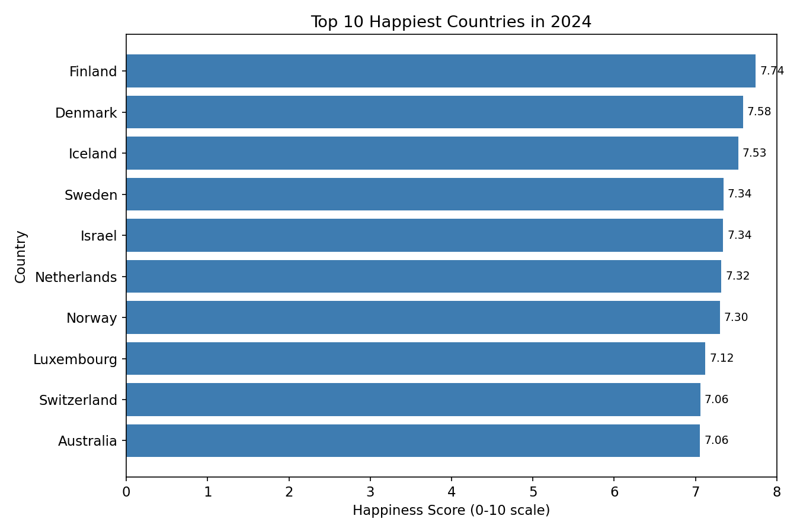
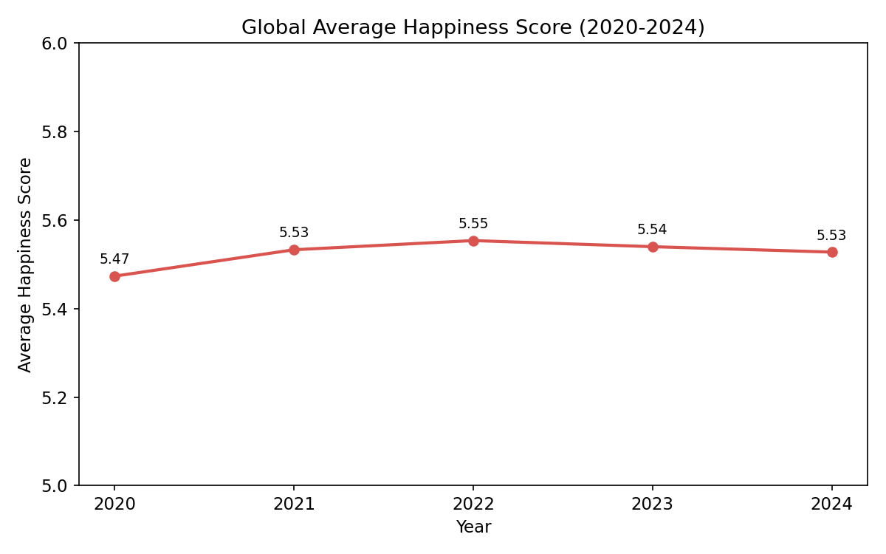
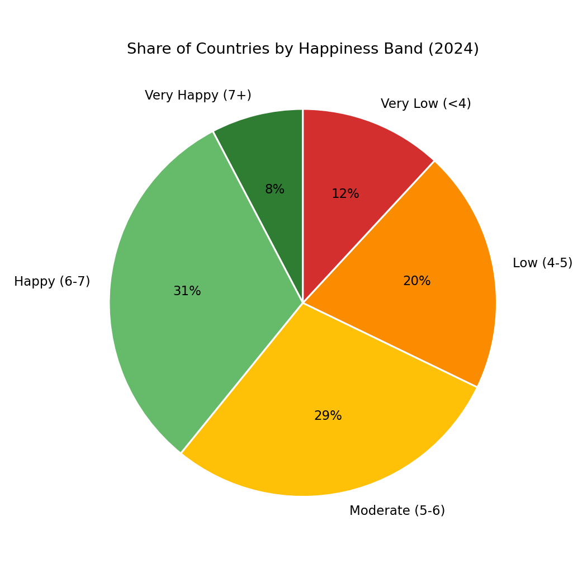
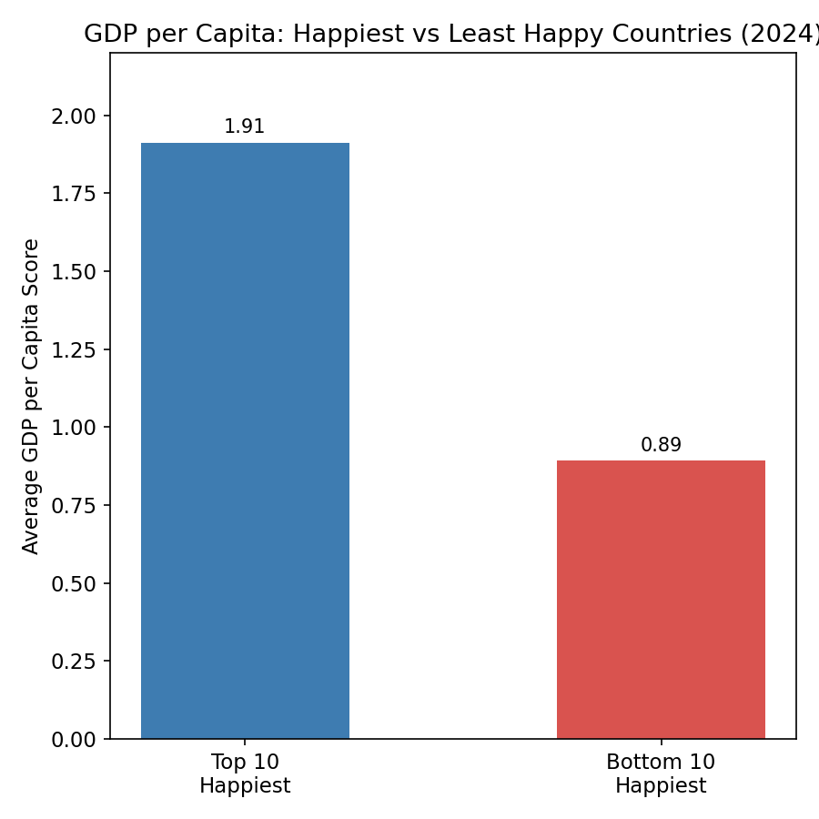

# First Chart Story: World Happiness Report (2020–2024)

**Track:** Data Analytics · Task 7
**Tool used:** Python (matplotlib) in Google Colab
**Dataset:** World Happiness Report — `happiness_cleaned.xlsx` (728 rows, 153 countries, years 2020–2024)

## Objective
Pick the right basic chart type for four different questions about the same dataset, and label each clearly.

---

## Chart 1 — Bar Chart
**Question:** Which countries are happiest right now?

**Takeaway:** Finland leads the 2024 rankings at 7.74, with Nordic and Western European countries dominating the top 10.

**Why a bar chart:** The question compares discrete categories (countries) at a single point in time — bars are for comparing magnitude across categories.

---

## Chart 2 — Line Chart
**Question:** How has global happiness changed over time?

**Takeaway:** Global average happiness rose slightly after 2020 (5.47 → 5.55 in 2022) then plateaued, staying essentially flat through 2024 (5.53).

**Why a line chart:** The question tracks change across a continuous sequence (years) — a line shows trend and direction that a bar chart would obscure.

---

## Chart 3 — Pie Chart
**Question:** What share of countries fall into each happiness category?

**Takeaway:** Only 8% of countries reach the "Very Happy" band, while 32% sit in the Low/Very Low bands — global happiness is unevenly distributed and skewed toward the middle.

**Why a pie chart:** The question is about parts of a whole — 5 mutually exclusive bands summing to 100% — within the recommended limit of 5 slices.

---

## Chart 4 — Bar Chart
**Question:** Does economic strength track with happiness?

**Takeaway:** The 10 happiest countries have more than double the average GDP-per-capita score of the 10 least happy (1.91 vs 0.89), suggesting wealth is strongly associated with — but not the sole driver of — happiness.

**Why a bar chart:** Comparing an average value across two discrete groups is again a category comparison, not a trend.

---

## Narrative: Tying the Charts Together

Across five years of World Happiness Report data, a consistent picture emerges: happiness is high and stable in a small cluster of wealthy Nordic/Western nations (Chart 1), while the global average has barely moved since 2020 (Chart 2) — meaning gains at the top haven't lifted the world overall. That's confirmed by the distribution itself: only 8% of countries are "Very Happy," while nearly a third sit in the Low or Very Low bands (Chart 3). Economic strength tracks closely with this gap — the happiest nations have over twice the GDP-per-capita score of the least happy (Chart 4) — but since even wealth doesn't push most countries above "Moderate," other factors such as social support, freedom to make life choices, and perceptions of corruption clearly play a role too.

---

## Interview Questions

**When would you choose a bar chart over a line chart?**
Use a bar chart when comparing values across distinct, unordered (or discrete) categories — e.g., countries, products, departments — where the goal is to see which is bigger or smaller. Use a line chart when the x-axis represents a continuous sequence, most commonly time, and the goal is to show a trend, rate of change, or direction rather than a single-moment comparison.

**Why are pie charts often discouraged in professional reporting?**
Humans are much better at comparing the length or position of bars than the angle or area of pie slices, so pie charts are harder to read accurately, especially once there are more than ~5 categories or the slices are close in size. They also can't show more than one variable per chart, don't handle negative values, and become cluttered quickly — a bar chart usually communicates the same part-to-whole comparison more precisely.

---

## Tools & Files
- `happiness_cleaned.xlsx` — source dataset
- `chart1_bar_top10.png`, `chart2_line_trend.png`, `chart3_pie_bands.png`, `chart4_bar_gdp_compare.png` — chart images
- All charts generated with Python (pandas + matplotlib) in Google Colab